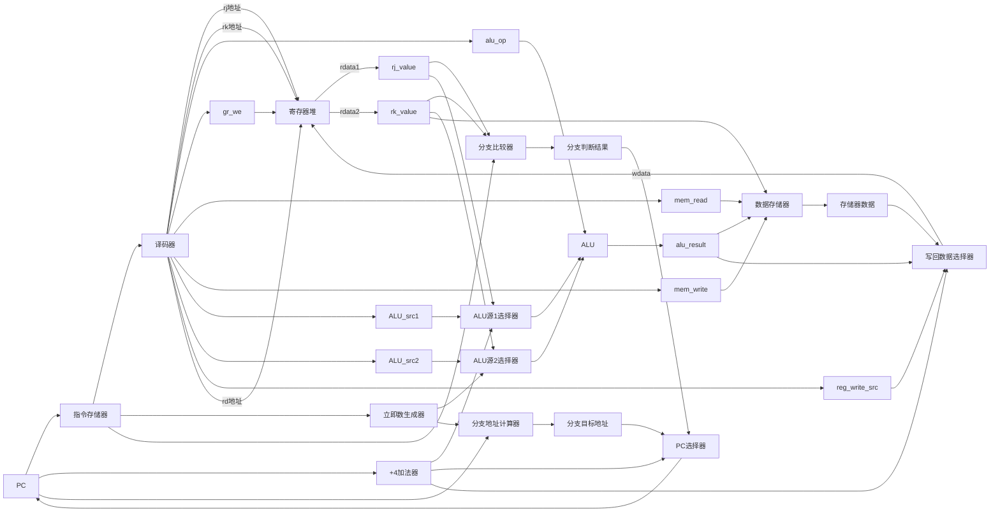

# RISC-V 处理器数据通路图



## 单周期CPU数据通路详细说明

### 设计特点：

#### 🔥 **单周期执行**
- **无流水线寄存器**：所有操作在一个时钟周期内完成
- **简化设计**：不需要考虑流水线冲突和数据前推
- **直接连接**：各功能单元直接相连，无中间缓存

### 关键组件说明：

#### 1. **译码器 (Decoder)**
- **输入**: 32位指令
- **输出**: 
  - rj, rk, rd 寄存器地址
  - 各种控制信号
- **功能**: 解析指令格式，生成所有控制信号

#### 2. **立即数生成器 (Immediate Generator)**
- **输入**: 32位指令
- **输出**: 32位符号扩展立即数
- **支持格式**: 
  - I型: `{{20{inst[31]}}, inst[31:20]}`
  - S型: `{{20{inst[31]}}, inst[31:25], inst[11:7]}`
  - B型: `{{19{inst[31]}}, inst[31], inst[7], inst[30:25], inst[11:8], 1'b0}`

#### 3. **分支比较器 (Branch Comparator)**
- **输入**: rj_value, rk_value
- **输出**: 分支判断结果
- **操作**: 
  - `beq`: rj_value == rk_value
  - `b`: 直接输出跳转信号

#### 4. **ALU源选择器**
- **ALU源1选择器**:
  - 00: rj_value (R型指令)
  - 01: PC+4 (某些跳转指令)
- **ALU源2选择器**:
  - 00: rk_value (R型指令)
  - 01: 立即数 (I型指令)

#### 5. **分支地址计算器**
- **功能**: 计算分支目标地址
- **公式**: `branch_target = PC + (imm << 1)`
- **输入**: 当前PC值 + 分支偏移立即数

#### 6. **写回数据选择器**
- **选择源**:
  - 00: ALU结果 (算术/逻辑指令)
  - 01: 存储器数据 (ld_w指令)
  - 10: PC+4 (某些跳转指令)

### 控制信号详解：

| 控制信号 | 功能说明 |
|---------|----------|
| `alu_op` | ALU运算类型选择 |
| `gr_we` | 寄存器写使能 |
| `mem_read` | 存储器读使能 |
| `mem_write` | 存储器写使能 |
| `ALU_src1` | ALU源1选择 |
| `ALU_src2` | ALU源2选择 |
| `reg_write_src` | 写回数据源选择 |

### 12条指令执行流程：

#### **R型指令 (add_w, sub_w, and, mul_w)**
1. 译码器解析rj, rk, rd地址
2. 寄存器堆读取rj_value, rk_value
3. ALU执行对应运算
4. 结果直接写回rd寄存器

#### **I型立即数指令 (addi_w, ori, slti, slli_w)**
1. 译码器解析rj, rd地址
2. 立即数生成器产生立即数
3. ALU执行 rj_value op imm
4. 结果写回rd寄存器

#### **加载指令 (ld_w)**
1. 译码器解析rj, rd地址
2. 立即数生成器产生地址偏移
3. ALU计算内存地址 = rj_value + imm
4. 数据存储器读取数据
5. 数据写回rd寄存器

#### **存储指令 (st_w)**
1. 译码器解析rj, rk地址
2. 立即数生成器产生地址偏移
3. ALU计算内存地址 = rj_value + imm
4. 将rk_value写入数据存储器

#### **分支指令 (b, beq)**
1. 译码器解析rj, rk地址（beq需要）
2. 分支比较器判断条件
3. 分支地址计算器计算目标地址
4. PC选择器选择下一个PC值

### 单周期设计优势：

✅ **简单直观**: 每条指令在一个周期内完成，易于理解和调试
✅ **无冲突**: 不存在流水线数据冲突和控制冲突
✅ **硬件简单**: 不需要流水线寄存器和复杂的冲突检测逻辑
✅ **精确异常**: 异常处理简单，无需考虑流水线状态

### 单周期设计限制：

⚠️ **性能限制**: 时钟频率受最长路径延迟限制
⚠️ **资源利用**: 功能单元利用率较低
⚠️ **功耗**: 每个周期所有单元都在工作

### 关键时序路径：
最长路径通常是：
```
PC → 指令存储器 → 译码器 → 寄存器堆 → ALU → 数据存储器 → 写回
```

这种单周期设计非常适合教学演示和理解RISC-V指令的基本执行流程！