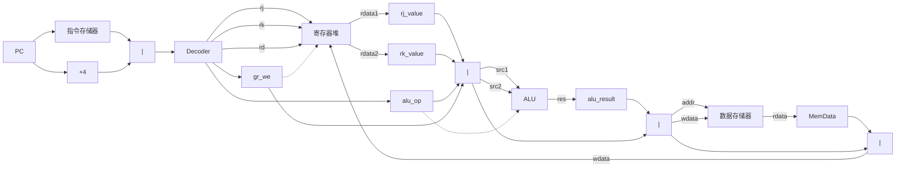

# RISC-V 处理器数据通路图

## 数据通路说明

### 五级流水线架构：

1. **IF (指令提取)**：
   - 程序计数器(PC)提供指令地址
   - 指令存储器读取指令
   - 计算下一条指令地址(PC+4)

2. **ID (指令译码)**：
   - 控制单元译码指令，生成控制信号
   - 立即数生成器从指令中提取立即数
   - 寄存器堆读取源寄存器数据
   - 分支比较器进行分支判断

3. **EX (执行)**：
   - ALU执行算术和逻辑运算
   - 选择器选择ALU的输入源
   - 计算分支目标地址

4. **MEM (存储访问)**：
   - 数据存储器进行读写操作
   - 分支选择器决定下一条指令地址

5. **WB (写回)**：
   - 选择写回数据(ALU结果或存储器数据)
   - 将结果写回寄存器堆

### 主要功能单元：

- **ALU**: 执行算术和逻辑运算
- **立即数生成器**: 从指令中提取并扩展立即数
- **寄存器堆**: 32个通用寄存器的存储
- **分支判断单元**: 比较寄存器值并生成分支条件
- **数据存储器**: 存储和读取数据

### 流水线寄存器：
- **IF/ID**: 保存指令和PC值
- **ID/EX**: 保存译码后的数据和控制信号
- **EX/MEM**: 保存执行结果和内存访问信息
- **MEM/WB**: 保存内存数据和写回信息