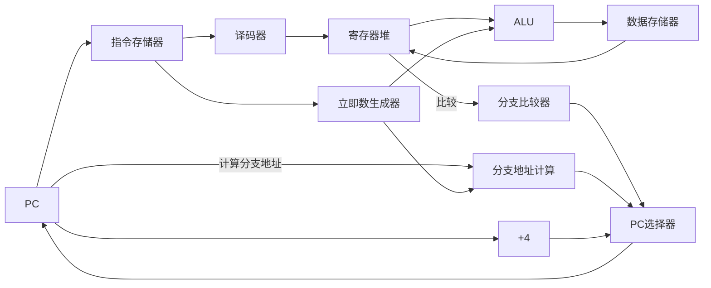

# RISC-V 处理器数据通路图

## 简化版RISC-V单周期CPU数据通路

### 📌 核心组件（仅保留关键元件）：

1. **PC** - 程序计数器
2. **指令存储器** - 存储指令
3. **译码器** - 解析指令
4. **立即数生成器** - 提取立即数
5. **寄存器堆** - 32个通用寄存器
6. **ALU** - 算术逻辑单元
7. **数据存储器** - 存储数据
8. **分支比较器** - 判断分支条件
9. **分支地址计算** - 计算跳转地址
10. **PC选择器** - 选择下一个PC
11. **+4加法器** - PC递增

### 🔄 执行流程（单周期）：

1. **取指令**: PC → 指令存储器
2. **译码**: 译码器解析指令
3. **读寄存器**: 寄存器堆输出数据
4. **执行**: ALU运算或地址计算
5. **访问存储器**: 读写数据存储器
6. **写回**: 结果写回寄存器
7. **更新PC**: 选择下一个指令地址

### 🎯 支持的12条指令：

| 类型 | 指令 | 特点 |
|------|------|------|
| R型 | add_w, sub_w, and, mul_w | 寄存器间运算 |
| I型 | addi_w, ori, slti, slli_w | 立即数运算 |
| 加载 | ld_w | 从存储器读数据 |
| 存储 | st_w | 向存储器写数据 |
| 分支 | b, beq | 条件/无条件跳转 |

### ✨ 设计优点：
- 简单直观，易于理解
- 无流水线冲突
- 一个周期完成一条指令
- 硬件简单，易于实现